# Data Warehouse ER Diagram - Complete Production Schema v3.4

## Complete Snowflake Schema - FINAL OPTIMIZED

```mermaid
erDiagram
    DIM_PRODUCT ||--o{ FACT_CONFIGURATION : "1:M"
    DIM_CUSTOMER ||--o{ FACT_CONFIGURATION : "1:M"
    DIM_CUSTOMER ||--o{ DIM_OPPORTUNITY : "1:M"
    DIM_OPPORTUNITY ||--o{ FACT_CONFIGURATION : "M:1"
    DIM_LOCATION_ADDRESS ||--o{ FACT_CONFIGURATION : "1:M (LocationA)"
    DIM_LOCATION_ADDRESS ||--o{ FACT_CONFIGURATION : "1:M (LocationZ)"

    DIM_PRODUCT {
        string ProductID PK
        string Product
        string ProductDescription
        string Tier1Product
        string Tier2Product
        string Tier3Product
        string Tier4Product
        string Tier5Product
        string SourceSystem
        timestamp xact_timestamp
    }

    DIM_CUSTOMER {
        string CustomerID PK
        string CompanyName
        string Industry
        string SfdcAcctNm
        string SfdcAcctChannel
        string SfdcAcctSubChannel
        string SfdcMktVertical
        string SfdcMktSubVertical
        string SfdcTargetTier
        string SfdcTargetGroup
        string SfdcPricingTier
        decimal SfdcGM
        string SfdcSalesOffice
        string SfdcAcctOwnerFirstNm
        string SfdcAcctOwnerLastNm
        string SfdcAcctOwnerTitle
        string SfdcBusOrg
        string SfdcUltCustNm
        string SfdcUltCustNbr
        string SfdcCustEID
        string SfdcDunsNbr
        string SfdcExtRptRollup
        string SfdcBusinessSegment
        string SfdcSalesRegion
        timestamp CreatedTimestamp
    }

    DIM_OPPORTUNITY {
        string OpportunityID PK
        string QuoteID PK
        string CustomerID FK
        string OpportunityName
        string RecordType
        string StageName
        string OpptyType
        string OpptySubType
        string IsQuoted
        string IsClosed
        string IsWon
        int IsActive
        string QuoteSystem
        string ReasonWonLostComments
        string PrimaryLostReason
        string Competitor
        date CreatedDate
        date LastModifiedDate
        date OpportunityCloseDate
        date SendToOrderDate
        string HasOpportunityLineItem
        string SalesClassification
        string AcctNm
        string AcctType
        string BusOrg
        string UltCustNm
        string UltCustNbr
        string CustEID
        string DunsNbr
        string ExtRptRollup
        string AcctChannel
        string AcctSubChannel
        string MktVertical
        string MktSubVertical
        string TargetTier
        string TargetGroup
        string PricingTier
        decimal GM
        string SalesOffice
        string SalesRegion
        string BusinessSegment
        string OpptyOwner
        string OpptyOwnerDir
        string SourcingAdvisor
        decimal TotalNewSalesMRC_USD
        decimal TotalNetRecurring_USD
        decimal TotalNRC_USD
        decimal TotalContractMRC_USD
        decimal TotalYRC_USD
        decimal TotalRevenue_USD
        timestamp CreatedTimestamp
    }

    DIM_LOCATION_ADDRESS {
        string GLMLocId PK
        string LocationType PK
        string LocationName
        string Address
        string City
        string State
        string PostalCode
        string CountryCode
        string Country
        decimal Latitude
        decimal Longitude
        string GLMOriginalLocId
        string ReportRegion
        string RevenueCity
        string RevenueState
        string RevenueCountryCode
        int GLM_ADDRESS_ID
        string GLM_SITE_ID
        string GLM_STREET_NUMBER
        string GLM_STREET_NUMBER_FRACTION
        string GLM_STREET_DIRECTION_PREFIX
        string GLM_STREET_NAME
        string GLM_STREET_NAME_SUFFIX
        string GLM_STREET_DIRECTION_SUFFIX
        string GLM_ADDRESS_LINE1
        string GLM_CITY
        string GLM_STATE
        string GLM_POSTAL_CODE
        string GLM_COUNTRY_CODE
        decimal GLM_LATITUDE
        decimal GLM_LONGITUDE
        string GLM_CLONES_CLLI_PREFIX
        string GLM_WIRE_CENTER_CLLI
        string GLM_IS_ON_NET
        string GLM_LOCAL_ACCESS
        string GLM_PRICING_REGION
        string GLM_PRICING_SUB_REGION
        string GLM_PRICING_AREA
        string GLM_ETHERNET
        string GLM_WAVE
        string GLM_TDM
        string GLM_NETWORK
        string GLM_BUILDING_STRUCTURE
        string GLM_BUILDING_PROGRAM
        string GLM_OCN_TYPE
        string GLM_CONNECTION_TYPE
        int GLM_SITE_COMPETITIVE_ENVIRON_ID
        string GLM_METRO_3
        string GLM_LUMEN_NETWORK
        string GLM_LOADTIME
        timestamp xact_timestamp
    }

    FACT_CONFIGURATION {
        string ConfigurationId PK
        string ProductID FK
        string BusOrgID FK
        string OpportunityID FK
        string QuoteID FK
        string GLMLocIdA FK
        string GLMLocIdZ FK
        string PriceDealId
        string UnitCostId
        string ProductDescription
        string DealState
        int Term
        decimal AccessQuantity
        string CompanyName
        string ReportRegionA
        string ReportRegionZ
        decimal AccessABW
        decimal AccessZBW
        decimal PortQuantity
        decimal PortBW
        string SourceSystem
        decimal GrossMargin
        decimal Payback
        decimal TotalListMRC
        decimal TotalDiscountedMRC
        decimal TotalAmortizedMRC
        decimal TotalListNRC
        decimal TotalAmortizedNRC
        decimal TotalIncrementalMRCost
        decimal TotalIncrementalNRCost
        decimal TotalIncrementalCapexCost
        string AccessTypeA
        string AccessTypeZ
        decimal AccessListMRC
        decimal AccessDiscountedMRC
        decimal AccessAmortizedMRC
        decimal AccessListNRC
        decimal AccessAmortizedNRC
        decimal AccessIncrementalMRCost
        decimal AccessIncrementalNRCost
        decimal AccessIncrementalCapexCost
        decimal TotalTermRevenueUSD
        decimal TotalTermEbitdaCostUSD
        decimal TotalTermEbitdaDollarsUSD
        string CurrencyCode
        string EmployeeName
        string Ignore
        decimal AccessASubBW
        decimal AccessZSubBW
        string PriceDealEntityProductItemId
        string VendorA
        string VendorZ
        int LineNumber
        decimal TotalCommit
        string xact_username
        timestamp xact_timestamp
        string SourceName
        string EXTERNALQUOTEID
        string PetraPricing
        string ColtIgnore
        string GLMOriginalLocIdA
        string GLMOriginalLocIdZ
        string DQPID
        decimal IntentA
        decimal IntentZ
        decimal TotalDiscountedMRCwAmortized
        decimal AccessDiscountedMRCwAmortized
        date QuoteCreateDate
        date QuoteUpdateDate
        decimal TotalListMrcOriginal
    }
```

---

## Production Schema v3.4 - COMPLETE REFERENCE

### 📊 Schema Overview

**Total Columns**: 162  
**Total Tables**: 4  
**Primary Keys**: 5  
**Foreign Keys**: 7  
**Composite Keys**: 2

---

### **DIM_PRODUCT** (10 Columns)

| Column | Type | Role | Description |
|--------|------|------|-------------|
| ProductID | STRING | PK | Product identifier |
| Product | STRING | | Product name |
| ProductDescription | STRING | | Detailed product description |
| Tier1Product | STRING | | Hierarchy level 1 |
| Tier2Product | STRING | | Hierarchy level 2 |
| Tier3Product | STRING | | Hierarchy level 3 |
| Tier4Product | STRING | | Hierarchy level 4 |
| Tier5Product | STRING | | Hierarchy level 5 |
| SourceSystem | STRING | | Source system (PETRA/SFDC) |
| xact_timestamp | TIMESTAMP | Audit | Transaction timestamp |

---

### **DIM_CUSTOMER** (24 Columns)

| Column | Type | Role | Description |
|--------|------|------|-------------|
| CustomerID | STRING | PK | Business organization ID |
| CompanyName | STRING | | Company name |
| Industry | STRING | | Industry classification |
| SfdcAcctNm | STRING | | Salesforce account name |
| SfdcAcctChannel | STRING | | Account channel |
| SfdcAcctSubChannel | STRING | | Account sub-channel |
| SfdcMktVertical | STRING | | Market vertical |
| SfdcMktSubVertical | STRING | | Market sub-vertical |
| SfdcTargetTier | STRING | | Target tier |
| SfdcTargetGroup | STRING | | Target group |
| SfdcPricingTier | STRING | | Pricing tier |
| SfdcGM | DECIMAL | | Gross margin |
| SfdcSalesOffice | STRING | | Sales office |
| SfdcAcctOwnerFirstNm | STRING | | Account owner first name |
| SfdcAcctOwnerLastNm | STRING | | Account owner last name |
| SfdcAcctOwnerTitle | STRING | | Account owner title |
| SfdcBusOrg | STRING | | Business organization |
| SfdcUltCustNm | STRING | | Ultimate customer name |
| SfdcUltCustNbr | STRING | | Ultimate customer number |
| SfdcCustEID | STRING | | Customer EID |
| SfdcDunsNbr | STRING | | DUNS number |
| SfdcExtRptRollup | STRING | | External report rollup |
| SfdcBusinessSegment | STRING | | Business segment |
| SfdcSalesRegion | STRING | | Sales region |
| CreatedTimestamp | TIMESTAMP | Audit | Record creation timestamp |

---

### **DIM_OPPORTUNITY** (48 Columns)

| Column | Type | Role | Description |
|--------|------|------|-------------|
| OpportunityID | STRING | PK | Opportunity identifier |
| QuoteID | STRING | PK | Quote identifier (SMID) |
| CustomerID | STRING | FK | Customer reference |
| OpportunityName | STRING | | Opportunity name |
| RecordType | STRING | | Salesforce record type |
| StageName | STRING | | Sales stage |
| OpptyType | STRING | | Opportunity type |
| OpptySubType | STRING | | Opportunity sub-type |
| IsQuoted | STRING | | Quote indicator (Y/N) |
| IsClosed | STRING | | Closed indicator (Y/N) |
| IsWon | STRING | | Won indicator (Y/N) |
| IsActive | INT | | Active indicator (1=Yes) |
| QuoteSystem | STRING | | Quote system (SFDC) |
| ReasonWonLostComments | STRING | | Win/loss comments |
| PrimaryLostReason | STRING | | Loss reason |
| Competitor | STRING | | Competitor info |
| CreatedDate | DATE | | Creation date |
| LastModifiedDate | DATE | | Last modified date |
| OpportunityCloseDate | DATE | | Close date |
| SendToOrderDate | DATE | | Send to order date |
| HasOpportunityLineItem | STRING | | Line items indicator |
| SalesClassification | STRING | | Sales classification |
| AcctNm | STRING | | Account name (denorm) |
| AcctType | STRING | | Account type (denorm) |
| BusOrg | STRING | | Business org (denorm) |
| UltCustNm | STRING | | Ultimate customer (denorm) |
| UltCustNbr | STRING | | Ultimate cust number (denorm) |
| CustEID | STRING | | Customer EID (denorm) |
| DunsNbr | STRING | | DUNS number (denorm) |
| ExtRptRollup | STRING | | Report rollup (denorm) |
| AcctChannel | STRING | | Account channel (denorm) |
| AcctSubChannel | STRING | | Sub-channel (denorm) |
| MktVertical | STRING | | Market vertical (denorm) |
| MktSubVertical | STRING | | Sub-vertical (denorm) |
| TargetTier | STRING | | Target tier (denorm) |
| TargetGroup | STRING | | Target group (denorm) |
| PricingTier | STRING | | Pricing tier (denorm) |
| GM | DECIMAL | | Gross margin (denorm) |
| SalesOffice | STRING | | Sales office (denorm) |
| SalesRegion | STRING | | Sales region (denorm) |
| BusinessSegment | STRING | | Business segment (denorm) |
| OpptyOwner | STRING | | Opportunity owner |
| OpptyOwnerDir | STRING | | Owner director |
| SourcingAdvisor | STRING | | Sourcing advisor |
| TotalNewSalesMRC_USD | DECIMAL | Financial | New sales MRC |
| TotalNetRecurring_USD | DECIMAL | Financial | Net recurring revenue |
| TotalNRC_USD | DECIMAL | Financial | Non-recurring revenue |
| TotalContractMRC_USD | DECIMAL | Financial | Contract MRC |
| TotalYRC_USD | DECIMAL | Financial | Year 1 recurring cost |
| TotalRevenue_USD | DECIMAL | Financial | Total revenue |
| CreatedTimestamp | TIMESTAMP | Audit | Record creation timestamp |

---

### **DIM_LOCATION_ADDRESS** (51 Columns)

**Core Location (16 cols)**
- GLMLocId (Composite PK)
- LocationType (Composite PK - A or Z)
- LocationName, Address, City, State
- PostalCode, CountryCode, Country
- Latitude, Longitude
- GLMOriginalLocId, ReportRegion
- RevenueCity, RevenueState, RevenueCountryCode

**GLMShort Street Address (9 cols)**
- GLM_ADDRESS_ID, GLM_SITE_ID
- GLM_STREET_NUMBER, GLM_STREET_NUMBER_FRACTION
- GLM_STREET_DIRECTION_PREFIX, GLM_STREET_NAME
- GLM_STREET_NAME_SUFFIX, GLM_STREET_DIRECTION_SUFFIX
- GLM_ADDRESS_LINE1

**GLMShort Geographic (5 cols)**
- GLM_CITY, GLM_STATE, GLM_POSTAL_CODE
- GLM_COUNTRY_CODE
- GLM_LATITUDE, GLM_LONGITUDE

**GLMShort Telecom (2 cols)**
- GLM_CLONES_CLLI_PREFIX, GLM_WIRE_CENTER_CLLI

**GLMShort Network (8 cols)**
- GLM_IS_ON_NET, GLM_LOCAL_ACCESS
- GLM_ETHERNET, GLM_WAVE, GLM_TDM, GLM_NETWORK
- GLM_BUILDING_STRUCTURE, GLM_BUILDING_PROGRAM

**GLMShort Classification (7 cols)**
- GLM_PRICING_REGION, GLM_PRICING_SUB_REGION, GLM_PRICING_AREA
- GLM_OCN_TYPE, GLM_CONNECTION_TYPE
- GLM_SITE_COMPETITIVE_ENVIRON_ID
- GLM_METRO_3, GLM_LUMEN_NETWORK

**Audit (2 cols)**
- GLM_LOADTIME, xact_timestamp

---

### **FACT_CONFIGURATION** (49 Columns)

**Keys (7 cols)**
- ConfigurationId (PK)
- ProductID (FK)
- BusOrgID (FK)
- OpportunityID (FK - Composite)
- QuoteID (FK - Composite)
- GLMLocIdA (FK)
- GLMLocIdZ (FK)

**Configuration Info (7 cols)**
- PriceDealId, UnitCostId, ProductDescription
- DealState, Term, PriceDealEntityProductItemId, LineNumber

**Deal Attributes (5 cols)**
- SourceName, EXTERNALQUOTEID, DQPID
- PetraPricing (Y/N), ColtIgnore (Y/N)

**Location References (2 cols)**
- ReportRegionA, ReportRegionZ

**Access & Quantity (6 cols)**
- AccessQuantity, AccessABW, AccessZBW
- AccessASubBW, AccessZSubBW, PortQuantity, PortBW

**Vendor Info (4 cols)**
- VendorA, VendorZ, AccessTypeA, AccessTypeZ

**Revenue - MRC (6 cols)**
- TotalListMRC, TotalDiscountedMRC, TotalAmortizedMRC
- AccessListMRC, AccessDiscountedMRC, AccessAmortizedMRC

**Revenue - NRC (4 cols)**
- TotalListNRC, TotalAmortizedNRC
- AccessListNRC, AccessAmortizedNRC

**Financial Metrics (6 cols)**
- GrossMargin, Payback, TotalCommit
- TotalListMrcOriginal, TotalDiscountedMRCwAmortized
- AccessDiscountedMRCwAmortized

**Incremental Costs (6 cols)**
- TotalIncrementalMRCost, TotalIncrementalNRCost
- TotalIncrementalCapexCost
- AccessIncrementalMRCost, AccessIncrementalNRCost
- AccessIncrementalCapexCost

**Term Revenue (3 cols)**
- TotalTermRevenueUSD, TotalTermEbitdaCostUSD
- TotalTermEbitdaDollarsUSD

**Intent Metrics (2 cols)**
- IntentA, IntentZ

**Location Original (2 cols)**
- GLMOriginalLocIdA, GLMOriginalLocIdZ

**Employee & Dates (5 cols)**
- EmployeeName, CurrencyCode
- SourceSystem, CompanyName
- Ignore (Y/N)

**Audit (3 cols)**
- xact_username, xact_timestamp
- QuoteCreateDate, QuoteUpdateDate

---

## Schema Relationships

### Cardinality

| From | To | Relationship | Cardinality |
|------|-----|--------------|-------------|
| DIM_PRODUCT | FACT_CONFIGURATION | ProductID | 1:M |
| DIM_CUSTOMER | FACT_CONFIGURATION | BusOrgID | 1:M |
| DIM_CUSTOMER | DIM_OPPORTUNITY | CustomerID | 1:M |
| DIM_OPPORTUNITY | FACT_CONFIGURATION | OpportunityID + QuoteID | M:1 |
| DIM_LOCATION_ADDRESS | FACT_CONFIGURATION | GLMLocIdA (Type=A) | 1:M |
| DIM_LOCATION_ADDRESS | FACT_CONFIGURATION | GLMLocIdZ (Type=Z) | 1:M |

---

## Key Features v3.4

### ✅ Optimized Design
- **Cleaner Naming**: GLM_ prefix for consistency
- **No Address Denormalization**: Access via FK relationships
- **Better Normalization**: Reduced redundancy
- **Composite Keys**: GLMLocId+LocationType, OpportunityID+QuoteID
- **Dual Location Support**: Type A & Z separation

### 📊 Column Distribution
- DIM_PRODUCT: 10 (6%)
- DIM_CUSTOMER: 24 (15%)
- DIM_OPPORTUNITY: 48 (30%)
- DIM_LOCATION_ADDRESS: 51 (31%)
- FACT_CONFIGURATION: 49 (18%)

### 🎯 Design Principles
- **Snowflake Schema** with denormalized dimensions
- **Complete Salesforce Integration** (Sfdc prefixes)
- **Financial Metrics** at opportunity & fact level
- **Geographic Hierarchy** with GLMShort data
- **Business Context** fully denormalized for OLAP

---

**Schema Version**: Production Ready v3.4 - FINAL ✓  
**Total Columns**: 162  
**Status**: ✓ OPTIMIZED & DEPLOYED  
**Last Updated**: 2026-06-08
