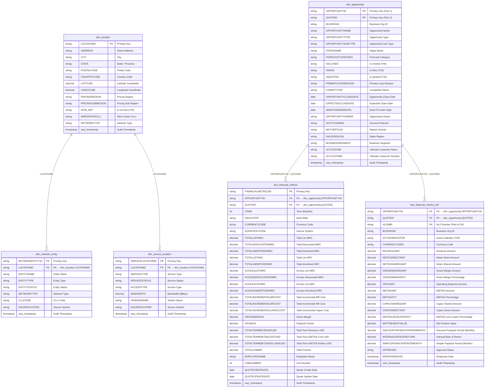

# Data Warehouse ER Diagram — dbo Schema

## Star / Snowflake Schema for Financial Metrics

---

## Schema Summary

| Table | Type | Rows (approx.) | Description |
|-------|------|----------------|-------------|
| `dbo.dim_location` | Dimension | — | Master location records (address, geo, network attributes) |
| `dbo.dim_network_entity` | Dimension | — | Network entity records keyed to a location |
| `dbo.dim_service_location` | Dimension | — | Service availability per location |
| `dbo.dim_opportunity` | Dimension | — | SFDC opportunity & quote records |
| `dbo.fact_financial_metrics` | Fact | — | Configuration-level financial metrics |
| `dbo.fact_financial_metrics_hl2` | Fact | — | Quote-level (HL2) profitability metrics |

---

## Relationships

| From | Column(s) | To | Column(s) | Cardinality |
|------|-----------|----|-----------|-------------|
| `dim_network_entity` | `LOCATIONID` | `dim_location` | `LOCATIONID` | M:1 |
| `dim_service_location` | `LOCATIONID` | `dim_location` | `LOCATIONID` | M:1 |
| `fact_financial_metrics` | `OPPORTUNITYID`, `QUOTEID` | `dim_opportunity` | `OPPORTUNITYID`, `QUOTEID` | M:1 |
| `fact_financial_metrics_hl2` | `OPPORTUNITYID`, `QUOTEID` | `dim_opportunity` | `OPPORTUNITYID`, `QUOTEID` | M:1 |

---

**Schema Version**: v1.0  
**Last Updated**: 2026-07-01
