# Fabric Data Warehouse - ER Diagram v4.1

## Complete Enterprise Star Schema for Fabric Lakehouse

```mermaid
erDiagram
    DIM_CUSTOMER ||--o{ DIM_OPPORTUNITY : "has"
    DIM_CUSTOMER ||--o{ FACT_CONFIGURATION : "references"
    DIM_PRODUCT ||--o{ FACT_CONFIGURATION : "has"
    DIM_OPPORTUNITY ||--o{ FACT_CONFIGURATION : "has"
    DIM_OPPORTUNITY ||--o{ FACT_PROFITMAX_HL1 : "has"
    DIM_LOCATION ||--o{ FACT_CONFIGURATION : "references (A)"
    DIM_LOCATION ||--o{ FACT_CONFIGURATION : "references (Z)"

    DIM_CUSTOMER {
        string CustomerID PK "Primary Key"
        string CompanyName "Company Name"
        string URCustNumber "Ultimate Customer Number"
        string URCustName "Ultimate Customer Name"
        string CostID "Cost ID"
        string ExtRptRollup "External Reporting Rollup"
        string AcctChannel "Account Channel"
        string AcctSubChannel "Account Sub Channel"
        string MktVertical "Market Vertical"
        string MktSubVertical "Market Sub Vertical"
        string TargetTier "Target Tier"
        string TargetGroup "Target Group"
        string PricingTier "Pricing Tier"
        decimal GM "Gross Margin %"
        string SalesOffice "Sales Office"
        string AcctOwnerFirstNm "Account Owner First Name"
        string AcctOwnerLastNm "Account Owner Last Name"
        string AcctOwnerTitle "Account Owner Title"
        string AcctOwnerEmail "Account Owner Email"
        string AcctOwnerCountryCode "Account Owner Country Code"
        string AcctOwnerRegion "Account Owner Region"
        string AcctOwnerSalesRegion "Account Owner Sales Region"
        string AcctOwnerManager "Account Owner Manager"
        string AcctOwnerDirector "Account Owner Director"
        string AcctOwnerVP "Account Owner VP"
        string GAM "Global Account Manager"
        string BusinessSegment "Business Segment"
        string Industry "Industry"
        string ErtTargetGroupCountry "ERT Target Group Country"
        string LOBID "LOB ID"
        string SKC "SKC Code"
        string SKCDescription "SKC Description"
        string SecureCompany "Secure Company"
        timestamp xact_timestamp "Audit Timestamp"
    }

    DIM_PRODUCT {
        string ProductID PK "Primary Key"
        string Product "Product Name"
        string ProductDescription "Product Description"
        string Tier1Product "Tier 1 Product"
        string Tier2Product "Tier 2 Product"
        string Tier3Product "Tier 3 Product"
        string Tier4Product "Tier 4 Product"
        string SourceSystem "Source System"
        timestamp xact_timestamp "Audit Timestamp"
    }

    DIM_LOCATION {
        string LocationID PK "Primary Key (Part 1)"
        string LocationType PK "Primary Key (Part 2 - A or Z)"
        string Address "Street Address"
        string City "City"
        string State "State"
        string PostalCode "Postal Code"
        string CountryCode "Country Code"
        decimal Latitude "Latitude Coordinate"
        decimal Longitude "Longitude Coordinate"
        string OriginalLocationID "Original Location ID"
        string CloneCLLIPrefix "Clone CLLI Prefix"
        string WireCenterCLLI "Wire Center CLLI"
        string IsOnNet "Is On Net"
        string StreetNumberFraction "Street Number Fraction"
        string StreetDirectionPrefix "Street Direction Prefix"
        string StreetName "Street Name"
        string StreetNameSuffix "Street Name Suffix"
        string StreetDirectionSuffix "Street Direction Suffix"
        string PricingRegion "Pricing Region"
        string PricingSubRegion "Pricing Sub Region"
        string PricingArea "Pricing Area"
        string TDM "TDM Service Available"
        string Ethernet "Ethernet Service Available"
        string Wave "Wave Service Available"
        string Network "Network Type"
        string LocalAccess "Local Access Type"
        string OCNType "OCN Type"
        string ConnectionType "Connection Type"
        string Metro3 "Metro 3 Classification"
        string LumenNetwork "Lumen Network"
        timestamp xact_timestamp "Audit Timestamp"
    }

    DIM_OPPORTUNITY {
        string OpportunityID PK "Primary Key (Part 1)"
        string QuoteID PK "Primary Key (Part 2)"
        string CustomerID FK "Foreign Key to DIM_CUSTOMER"
        string OpportunityName "Opportunity Name"
        string OpportunityType "Opportunity Type"
        string OpportunitySubType "Opportunity Sub Type"
        string StageName "Stage Name"
        string SubTypeMotion "Sub Type Motion"
        string RecordType "Record Type"
        string IsQuoted "Is Quoted"
        string IsClosed "Is Closed"
        string IsWon "Is Won"
        string PrimaryLosReason "Primary Loss Reason"
        string ReasonWonLostComments "Reason Won Lost Comments"
        string Competitor "Competitor Name"
        string HasOpportunityLineItem "Has Line Item"
        date PreDeployDate "Pre Deploy Date"
        date PreDeployStatusDate "Pre Deploy Status Date"
        date OpportunityCloseDate "Opportunity Close Date"
        date SendToOrderDate "Send To Order Date"
        date ExpectedCloseDate "Expected Close Date"
        string OpportunityOwner "Opportunity Owner"
        string OpptyOwnerDirector "Opportunity Owner Director"
        string OpptyOwnerCUID "Opportunity Owner CUID"
        string OpptyOwnerVPNAME "Opportunity Owner VP Name"
        string OpptyOwnerEmail "Opportunity Owner Email"
        string OpportunityOwnerCountryCode "Opportunity Owner Country Code"
        string OpportunityOwnerRegion "Opportunity Owner Region"
        string OpptyOwnerSalesRegion "Opportunity Owner Sales Region"
        string SourcingAdvisor "Sourcing Advisor"
        string AcctNm "Account Name"
        string AcctType "Account Type"
        string BusOrg "Business Organization"
        string UltCustNm "Ultimate Customer Name"
        string UltCustNbr "Ultimate Customer Number"
        string CustEID "Customer EID"
        string DunsNbr "DUNS Number"
        string ExtRptRollup "External Reporting Rollup"
        string AcctChannel "Account Channel"
        string AcctSubChannel "Account Sub Channel"
        string MktVertical "Market Vertical"
        string MktSubVertical "Market Sub Vertical"
        string TargetTier "Target Tier"
        string TargetGroup "Target Group"
        string PricingTier "Pricing Tier"
        decimal GM "Gross Margin %"
        string SalesOffice "Sales Office"
        string SalesRegion "Sales Region"
        string BusinessSegment "Business Segment"
        string CIESales "CIE Sales"
        string MigratingFromProduct "Migrating From Product"
        string SalesClassification "Sales Classification"
        string ForecastCategory "Forecast Category"
        timestamp xact_timestamp "Audit Timestamp"
    }

    FACT_CONFIGURATION {
        string ConfigurationId PK "Primary Key"
        string ProductID FK "Foreign Key to DIM_PRODUCT"
        string CustomerID FK "Foreign Key to DIM_CUSTOMER"
        string OpportunityID FK "Foreign Key to DIM_OPPORTUNITY"
        string QuoteID FK "Foreign Key to DIM_OPPORTUNITY"
        string LocationIDa FK "Foreign Key to DIM_LOCATION (Origin)"
        string LocationIDz FK "Foreign Key to DIM_LOCATION (Destination)"
        string UnitCostID "Unit Cost ID"
        string DealStatus "Deal Status"
        date ProposalSignedDate "Proposal Signed Date"
        string DealState "Deal State"
        int Term "Term (Months)"
        date QuoteCreateDate "Quote Create Date"
        date QuoteUpdateDate "Quote Update Date"
        string ReportRegionA "Report Region A"
        string ReportRegionZ "Report Region Z"
        string RevenueCityA "Revenue City A"
        string RevenueStateA "Revenue State A"
        string RevenueCountryCodeA "Revenue Country Code A"
        string RevenueCityZ "Revenue City Z"
        string RevenueStateZ "Revenue State Z"
        string RevenueCountryCodeZ "Revenue Country Code Z"
        decimal AccessABW "Access A Bandwidth"
        decimal AccessZBW "Access Z Bandwidth"
        decimal PortQuantity "Port Quantity"
        decimal PortBW "Port Bandwidth"
        string AccessTypeA "Access Type A"
        string AccessTypeZ "Access Type Z"
        decimal AccessListMRC "Access List MRC"
        decimal AccessAmortizedMRC "Access Amortized MRC"
        decimal AccessListNRC "Access List NRC"
        decimal AccessAmortizedNRC "Access Amortized NRC"
        decimal TotalListMRC "Total List MRC"
        decimal TotalAmortizedMRC "Total Amortized MRC"
        decimal TotalListNRC "Total List NRC"
        decimal TotalAmortizedNRC "Total Amortized NRC"
        decimal AccessIncrementalMRCost "Access Incremental MR Cost"
        decimal AccessIncrementalNRCost "Access Incremental NR Cost"
        decimal AccessIncrementalCapexCost "Access Incremental Capex Cost"
        decimal TotalIncrementalMRCost "Total Incremental MR Cost"
        decimal TotalIncrementalNRCost "Total Incremental NR Cost"
        decimal TotalIncrementalCapexCost "Total Incremental Capex Cost"
        string VendorA "Vendor A"
        string VendorZ "Vendor Z"
        decimal IntentA "Intent A"
        decimal IntentZ "Intent Z"
        string SourceSystem "Source System"
        decimal GrossMargin "Gross Margin Amount"
        decimal Payback "Payback Period"
        string CSGResponse "CSG Response"
        string PriceDealID "Price Deal ID"
        string CurrencyCode "Currency Code"
        string EmployeeName "Employee Name"
        int LineNumber "Line Number"
        decimal TotalCommit "Total Commit"
        decimal AccessASubBW "Access A Sub Bandwidth"
        decimal AccessZSubBW "Access Z Sub Bandwidth"
        decimal TotalTermRevenueUSD "Total Term Revenue USD"
        decimal TotalTermEbitdaCostUSD "Total Term EBITDA Cost USD"
        decimal TotalTermEbitdaDollarsUSD "Total Term EBITDA Dollars USD"
        decimal TotalTermVGMDollarsUSD "Total Term VGM Dollars USD"
        decimal TotalDiscountedMRC "Total Discounted MRC"
        string Ignore "Ignore Flag"
        string ColtIgnore "Colt Ignore Flag"
        string PetraPricing "Petra Pricing"
        timestamp xact_timestamp "Audit Timestamp"
    }

    FACT_PROFITMAX_HL1 {
        string UnitCostID PK "Primary Key (Part 1)"
        string QuoteID PK "Primary Key (Part 2)"
        string HL1Nbr PK "Primary Key (Part 3)"
        string OpportunityID FK "Foreign Key to DIM_OPPORTUNITY"
        string ActiveIndicator "Active Indicator"
        string CurrencyCode "Currency Code"
        decimal RevenueAmt "Revenue Amount"
        decimal NetexDirectAmt "Netex Direct Amount"
        decimal NetexSharedAmt "Netex Shared Amount"
        decimal GrossMarginAmt "Gross Margin Amount"
        decimal GrossMarginPct "Gross Margin Percentage"
        decimal OpexAmt "Operating Expense Amount"
        decimal EbitdaAmt "EBITDA Amount"
        decimal EbitdaPct "EBITDA Percentage"
        decimal CapexSharedAmt "Capex Shared Amount"
        decimal CapexDirectAmt "Capex Direct Amount"
        decimal EbitdaLessCapexPct "EBITDA Less Capex Percentage"
        decimal NetPresentValue "Net Present Value"
        decimal DiscountPaybackPeriodMonth "Discount Payback Period (Months)"
        decimal InternalRateOfReturn "Internal Rate of Return"
        decimal SimplePaybackPeriodMonth "Simple Payback Period (Months)"
        string Approved "Approval Status"
        string DisplayMessage "Display Message"
        timestamp ResponseDate "Response Date"
        timestamp xact_timestamp "Audit Timestamp"
    }
```

---

## Schema Statistics

| Metric | Value |
|--------|-------|
| **Total Tables** | 6 |
| **Dimension Tables** | 4 |
| **Fact Tables** | 2 |
| **Total Columns** | 225+ |
| **Primary Keys** | 8 |
| **Foreign Keys** | 7 |
| **Composite Keys** | 3 |

---

## Table Specifications

### **DIM_CUSTOMER** (33 Columns)
Customer/Account master dimension

**Core Attributes (5 cols)**
- CustomerID (PK), CompanyName, CostID
- URCustNumber, URCustName

**Classification (15 cols)**
- AcctChannel, AcctSubChannel, MktVertical, MktSubVertical
- TargetTier, TargetGroup, PricingTier, GM
- SalesOffice, ExtRptRollup, BusinessSegment, Industry
- LOBID, SKC, SKCDescription

**Org Hierarchy (11 cols)**
- AcctOwnerFirstNm, AcctOwnerLastNm, AcctOwnerTitle
- AcctOwnerEmail, AcctOwnerCountryCode, AcctOwnerRegion
- AcctOwnerSalesRegion, AcctOwnerManager, AcctOwnerDirector
- AcctOwnerVP, GAM

**Additional (2 cols)**
- ErtTargetGroupCountry, SecureCompany

**Audit (1 col)**
- xact_timestamp

---

### **DIM_PRODUCT** (9 Columns)
Product hierarchy dimension

- ProductID (PK)
- Product, ProductDescription
- Tier1Product, Tier2Product, Tier3Product, Tier4Product
- SourceSystem
- xact_timestamp

---

### **DIM_LOCATION** (31 Columns)
Location dimension with composite key (LocationID + LocationType)

**Geographic (10 cols)**
- LocationID (PK), LocationType (PK - A/Z)
- Address, City, State, PostalCode
- CountryCode, Latitude, Longitude
- OriginalLocationID

**Network & CLLI (6 cols)**
- CloneCLLIPrefix, WireCenterCLLI, IsOnNet
- PricingRegion, PricingSubRegion, PricingArea

**Service Availability (3 cols)**
- TDM, Ethernet, Wave

**Street Details (5 cols)**
- StreetNumberFraction, StreetDirectionPrefix
- StreetName, StreetNameSuffix, StreetDirectionSuffix

**Connectivity (4 cols)**
- Network, LocalAccess, OCNType, ConnectionType

**Classification (2 cols)**
- Metro3, LumenNetwork

**Audit (1 col)**
- xact_timestamp

---

### **DIM_OPPORTUNITY** (56 Columns)
Opportunity/Quote dimension

**Primary Keys (2 cols)**
- OpportunityID (PK), QuoteID (PK)

**Foreign Key (1 col)**
- CustomerID (FK)

**Core Opportunity (11 cols)**
- OpportunityName, OpportunityType, OpportunitySubType
- StageName, SubTypeMotion, RecordType, IsQuoted
- IsClosed, IsWon, ForecastCategory

**Dates (5 cols)**
- PreDeployDate, PreDeployStatusDate, OpportunityCloseDate
- SendToOrderDate, ExpectedCloseDate

**Status (4 cols)**
- PrimaryLosReason, ReasonWonLostComments, Competitor
- HasOpportunityLineItem

**Ownership (9 cols)**
- OpportunityOwner, OpptyOwnerDirector, OpptyOwnerCUID
- OpptyOwnerVPNAME, OpptyOwnerEmail, OpportunityOwnerCountryCode
- OpportunityOwnerRegion, OpptyOwnerSalesRegion, SourcingAdvisor

**Denormalized Account (18 cols)**
- AcctNm, AcctType, BusOrg, UltCustNm, UltCustNbr
- CustEID, DunsNbr, ExtRptRollup, AcctChannel, AcctSubChannel
- MktVertical, MktSubVertical, TargetTier, TargetGroup
- PricingTier, GM, SalesOffice, SalesRegion, BusinessSegment

**Additional (4 cols)**
- CIESales, MigratingFromProduct, SalesClassification
- xact_timestamp

---

### **FACT_CONFIGURATION** (62 Columns)
Central fact table with all configuration metrics

**Keys (7 cols)**
- ConfigurationId (PK)
- ProductID (FK), CustomerID (FK)
- OpportunityID (FK), QuoteID (FK)
- LocationIDa (FK), LocationIDz (FK)

**Deal Info (8 cols)**
- UnitCostID, DealStatus, ProposalSignedDate
- DealState, Term, QuoteCreateDate, QuoteUpdateDate, PriceDealID

**Location Data (12 cols)**
- ReportRegionA, ReportRegionZ
- RevenueCityA, RevenueStateA, RevenueCountryCodeA
- RevenueCityZ, RevenueStateZ, RevenueCountryCodeZ

**Access & Bandwidth (5 cols)**
- AccessABW, AccessZBW, PortQuantity, PortBW
- AccessASubBW, AccessZSubBW (Intent columns)

**Access Type & Vendor (4 cols)**
- AccessTypeA, AccessTypeZ, VendorA, VendorZ

**Revenue - MRC (6 cols)**
- AccessListMRC, AccessAmortizedMRC
- TotalListMRC, TotalAmortizedMRC, TotalDiscountedMRC
- IntentA, IntentZ

**Revenue - NRC (4 cols)**
- AccessListNRC, AccessAmortizedNRC
- TotalListNRC, TotalAmortizedNRC

**Costs (6 cols)**
- AccessIncrementalMRCost, AccessIncrementalNRCost
- AccessIncrementalCapexCost, TotalIncrementalMRCost
- TotalIncrementalNRCost, TotalIncrementalCapexCost

**Financial Metrics (8 cols)**
- GrossMargin, Payback, TotalCommit
- TotalTermRevenueUSD, TotalTermEbitdaCostUSD
- TotalTermEbitdaDollarsUSD, TotalTermVGMDollarsUSD, CSGResponse

**Admin (5 cols)**
- SourceSystem, CurrencyCode, EmployeeName, LineNumber
- Ignore, ColtIgnore, PetraPricing

**Audit (1 col)**
- xact_timestamp

---

### **FACT_PROFITMAX_HL1** (25 Columns)
Quote-level profitability metrics

**Primary Keys (3 cols)**
- UnitCostID (PK), QuoteID (PK), HL1Nbr (PK)

**Foreign Key (1 col)**
- OpportunityID (FK)

**Status (2 cols)**
- ActiveIndicator, CurrencyCode

**Revenue (3 cols)**
- RevenueAmt, NetexDirectAmt, NetexSharedAmt

**Profitability (4 cols)**
- GrossMarginAmt, GrossMarginPct, OpexAmt
- EbitdaAmt, EbitdaPct, EbitdaLessCapexPct

**Capex (2 cols)**
- CapexSharedAmt, CapexDirectAmt

**Investment Metrics (4 cols)**
- NetPresentValue, DiscountPaybackPeriodMonth
- InternalRateOfReturn, SimplePaybackPeriodMonth

**Approval (3 cols)**
- Approved, DisplayMessage, ResponseDate

**Audit (1 col)**
- xact_timestamp

---

## Relationships & Cardinality

| From | To | Type | Cardinality |
|------|-----|------|-------------|
| DIM_CUSTOMER | DIM_OPPORTUNITY | has | 1:M |
| DIM_CUSTOMER | FACT_CONFIGURATION | references | 1:M |
| DIM_PRODUCT | FACT_CONFIGURATION | has | 1:M |
| DIM_OPPORTUNITY | FACT_CONFIGURATION | has | M:1 |
| DIM_OPPORTUNITY | FACT_PROFITMAX_HL1 | has | 1:M |
| DIM_LOCATION | FACT_CONFIGURATION | references (A) | 1:M |
| DIM_LOCATION | FACT_CONFIGURATION | references (Z) | 1:M |

---

## Key Metrics Available

**Revenue Analysis**
- TotalTermRevenueUSD, RevenueAmt, NetexDirectAmt, NetexSharedAmt

**Profitability**
- GrossMarginAmt, GrossMarginPct, EbitdaAmt, EbitdaPct, TotalTermEbitdaDollarsUSD

**Costs**
- OpexAmt, CapexSharedAmt, CapexDirectAmt, TotalIncrementalMRCost, TotalIncrementalNRCost

**Investment**
- NetPresentValue, DiscountPaybackPeriodMonth, SimplePaybackPeriodMonth, InternalRateOfReturn

**Pricing**
- TotalListMRC, TotalDiscountedMRC, TotalAmortizedMRC, TotalListNRC, TotalAmortizedNRC

---

## BI Integration Ready

✅ **Power BI** - Direct Fabric Lakehouse connection  
✅ **Tableau** - Delta Lake native support  
✅ **Excel** - Power Query integration  
✅ **SQL Analytics** - Direct T-SQL query  

---

**Schema Version**: Production Ready v4.1 ✓  
**Format**: Delta Lake  
**Location**: Fabric Lakehouse  
**Total Columns**: 225+  
**Status**: ✓ READY FOR DEPLOYMENT
