# Data Warehouse ER Diagram (Mermaid) - Production Ready

## Complete Snowflake Schema with 223 Columns

```mermaid
erDiagram
    DIM_PRODUCT ||--o{ FACT_CONFIGURATION : "1:N"
    DIM_LOCATION_ADDRESS ||--o{ FACT_CONFIGURATION : "2:1 (A & Z)"
    DIM_CUSTOMER ||--o{ FACT_CONFIGURATION : "N:1"
    DIM_CUSTOMER ||--o{ DIM_OPPORTUNITY : "1:N"
    DIM_OPPORTUNITY ||--o{ FACT_CONFIGURATION : "N:1"

    DIM_PRODUCT {
        string ProductID PK
        string ProductName
        string ProductDescription
        string Tier1Product
        string Tier2Product
        string Tier3Product
        string Tier4Product
        string Tier5Product
        string SourceSystem
        timestamp xact_timestamp
    }

    DIM_LOCATION_ADDRESS {
        string GLMLocId PK
        string LocationType PK "A or Z"
        string LocationName
        string Address
        string City
        string State
        string PostalCode
        string CountryCode
        string Country
        decimal Latitude
        decimal Longitude
        string GLMOriginalLocId
        string ReportRegion
        string RevenueCity
        string RevenueState
        string RevenueCountryCode
        string AddressId
        string SiteId
        string StreetNumber
        string AddressLine1
        string PricingRegion
        string IsOnNet
        string EthernetAvailable
        string WaveAvailable
        string TDMAvailable
        string LocalAccess
        string BuildingStructure
        string OCNType
        string ConnectionType
        string Metro3
        string LumenNetwork
        string WireCenterCLLI
        string GLMParentId
        string GLMRegionCode
        string GLMRegionName
        string GLMCountryCode
        string GLMCountryName
        string GLMSalesArea
        string GLMShortName
        string GLMLongName
        string GLMStatus
        string GLMTimeZone
        string GLMSubRegion
        string GLMCluster
        string GLMMarket
        string GLMTerritory
        string GLMDivision
        string GLMBusinessUnit
        string GLMCostCenter
        string GLMProfitCenter
    }

    DIM_CUSTOMER {
        string CustomerID PK
        string CompanyName
        string AcctType
        string Industry
        string BusOrg
        string EntTargetGroupInCountry
        string UltCustNm
        string UltCustNbr
        string CustEID
        string DunsNbr
        string ExtRptRollup
        string AcctChannel
        string AcctSubChannel
        string MktVertical
        string MktSubVertical
        string TargetTier
        string TargetGroup
        string PricingTier
        decimal GM
        string SalesOffice
        string BusinessSegment
        string SalesRegion
        string AcctOwnerFirstNm
        string AcctOwnerLastNm
        string AcctOwnerTitle
        string AcctOwnerCUID
        string AcctOwnerEmail
        string AcctOwnerRegion
        string AcctOwnerCountryCode
        string AcctOwnerSalesRegion
        string AcctOwnerManager
        string AcctOwnerDirector
        timestamp merge_timestamp
    }

    DIM_OPPORTUNITY {
        string OpportunityID PK
        string QuoteID PK
        string CustomerID FK
        string OpportunityName
        string RecordType
        string StageName
        string OpptyType
        string OpptySubType
        string IsHighImpactOpportunity
        string HasOpportunityLineItem
        string IsQuoted
        string IsClosed
        string IsWon
        string IsActive
        string ReasonWonLostComments
        string PrimaryLostReason
        string Competitor
        string QuoteSystem
        string OpptyOwner
        string OpptyOwnerDir
        string SourcingAdvisor
        string AcctNm
        string AcctType
        string Industry
        string BusOrg
        string EntTargetGroupInCountry
        string UltCustNm
        string UltCustNbr
        string CustEID
        string DunsNbr
        string ExtRptRollup
        string AcctChannel
        string AcctSubChannel
        string MktVertical
        string MktSubVertical
        string TargetTier
        string TargetGroup
        string PricingTier
        decimal GM
        string SalesOffice
        string BusinessSegment
        string SalesRegion
        string AcctOwnerFirstName
        string AcctOwnerLastName
        string AcctOwnerTitle
        date CreatedDate
        date LastModifiedDate
        date OpportunityCloseDate
        date SendToOrderDate
        decimal TotalNewSalesMRC_USD
        decimal TotalNetRecurring_USD
        decimal TotalNRC_USD
        decimal TotalContractMRC_USD
        decimal TotalYRC_USD
        decimal TotalRevenue_USD
        timestamp merge_timestamp
    }

    FACT_CONFIGURATION {
        string ConfigurationId PK
        string ProductID FK
        string CustomerID FK
        string OpportunityID FK
        string QuoteID FK
        string LocationIdA FK
        string LocationTypeA FK
        string LocationIdZ FK
        string LocationTypeZ FK
        string OrderQuoteId
        string PriceDealId
        string SmEntityIdLink
        string UnitCostId
        int LineNumber
        string SourceName
        string EXTERNALQUOTEID
        string PriceDealEntityProductItemId
        string DealStatus
        string DealState
        int Term
        string PetraPricing
        string PetraPromo
        string ColtIgnore
        string DQPID
        string Ignore
        string ReportRegionA
        string ReportRegionZ
        string AccessTypeA
        string AccessTypeZ
        string VendorA
        string VendorZ
        date ProposalSignedDate
        date CreateDate
        date UpdateDate
        date QuoteCreateDate
        date QuoteUpdateDate
        decimal IntentA
        decimal IntentZ
        decimal AccessQuantity
        decimal PortQuantity
        decimal PortBW
        decimal AccessABW
        decimal AccessZBW
        decimal AccessASubBW
        decimal AccessZSubBW
        decimal TotalListMRC
        decimal TotalDiscountedMRC
        decimal TotalAmortizedMRC
        decimal AccessListMRC
        decimal AccessDiscountedMRC
        decimal AccessAmortizedMRC
        decimal TotalListNRC
        decimal TotalAmortizedNRC
        decimal AccessListNRC
        decimal AccessAmortizedNRC
        decimal GrossMargin
        decimal GrossMarginTarget
        string IsGrossMarginSatisfied
        decimal Payback
        decimal PaybackTarget
        string IsPaybackSatisfied
        decimal ROI
        decimal ROITarget
        decimal TotalDiscountedMRCwAmortized
        decimal AccessDiscountedMRCwAmortized
        decimal TotalListMrcOriginal
        decimal TotalCommit
        decimal TotalMRCFloor1
        decimal TotalMRCFloor2
        decimal TotalMRCFloor3
        decimal TotalNRCFloor1
        decimal TotalNRCFloor2
        decimal TotalNRCFloor3
        decimal AccessMRCFloor1
        decimal AccessMRCFloor2
        decimal AccessMRCFloor3
        decimal AccessNRCFloor1
        decimal AccessNRCFloor2
        decimal AccessNRCFloor3
        decimal TotalIncrementalMRCost
        decimal TotalIncrementalNRCost
        decimal TotalIncrementalCapexCost
        decimal AccessIncrementalMRCost
        decimal AccessIncrementalNRCost
        decimal AccessIncrementalCapexCost
        decimal TotalMonthlyProfitUSD
        decimal TotalInitialCashFlowUSD
        decimal TotalTermRevenueUSD
        decimal TotalTermEbitdaCostUSD
        decimal TotalTermEbitdaDollarsUSD
        decimal TotalTermVGMDollarsUSD
        string EmployeeName
        string UserId
        string EmployeeRegion
        string EmployeeCountry
        string OrganizationalUnit
        string FunctionDivision
        string IsManaged
        decimal DiscountPercent
        string CurrencyCode
        string CSGResponse
        string CalculationType
        string CrossFunctionalUnitCode
        string ChannelTypeId
        string HasCAR
        timestamp xact_timestamp
        string xact_username
        string RecordStatus
        date RecordModifiedDate
    }
```



---

## Schema Architecture Overview

### Tables & Cardinality

| From | To | Relationship | Type | Description |
|------|----|----|------|-------------|
| **DIM_PRODUCT** | FACT_CONFIGURATION | 1:N | One-to-Many | One product has many configurations |
| **DIM_CUSTOMER** | FACT_CONFIGURATION | N:1 | Many-to-One | Many configurations point to one customer |
| **DIM_OPPORTUNITY** | FACT_CONFIGURATION | N:1 | Many-to-One | Many configurations from same opportunity |
| **DIM_LOCATION_ADDRESS** | FACT_CONFIGURATION | 2:1 | Dual Reference | LocationA + LocationZ (both point to same table) |
| **DIM_CUSTOMER** | DIM_OPPORTUNITY | 1:N | One-to-Many | One customer has many opportunities |

---

## Table Statistics

| Table | Columns | Key Features | Row Estimate |
|-------|---------|--------------|--------------|
| **DIM_PRODUCT** | 10 | 5-tier hierarchy | ~1,000-5,000 |
| **DIM_LOCATION_ADDRESS** | 45 | Composite PK (GLMLocId+LocationType), Full GLMShort data | ~50,000-100,000 |
| **DIM_CUSTOMER** | 31 | Account master, owner info, business attributes | ~10,000-50,000 |
| **DIM_OPPORTUNITY** | 50 | Composite PK (OpptyID+QuoteID), Denormalized account data, Financial metrics | ~100,000-500,000 |
| **FACT_CONFIGURATION** | 115 | Complete metrics family, Composite FKs, Multi-dimensional | ~1,000,000+ |

**Total: 251 columns** across **5 tables**

---

## Key Design Principles

### 1. Composite Keys
```
DIM_OPPORTUNITY:
  PK: OpportunityID + QuoteID
  
FACT_CONFIGURATION:
  FK: OpportunityID + QuoteID → DIM_OPPORTUNITY (Composite)
  
DIM_LOCATION_ADDRESS:
  PK: GLMLocId + LocationType
  
FACT_CONFIGURATION:
  FK: LocationIdA + LocationTypeA → DIM_LOCATION (Type=A)
  FK: LocationIdZ + LocationTypeZ → DIM_LOCATION (Type=Z)
```

### 2. Dual Location Support
- **LocationA**: Customer location (Type=A)
- **LocationZ**: Facility/Vendor location (Type=Z)
- Both reference same DIM_LOCATION_ADDRESS table with location type filter

### 3. Denormalization Strategy
- **DIM_OPPORTUNITY**: Includes full denormalized account data from DIM_CUSTOMER
- **FACT_CONFIGURATION**: Includes all financial, margin, and operational metrics

### 4. Complete GLMShort Integration
- All 34 columns from GLMShort table in DIM_LOCATION_ADDRESS
- Includes network capabilities (Ethernet, Wave, TDM, LocalAccess)
- Building structure, connection type, OCN type data
- Metro area, Lumen network, wire center CLLI data

---

## Metrics Coverage (115 Fact Columns)

### Configuration Data (16 cols)
OrderQuoteId, PriceDealId, SmEntityIdLink, UnitCostId, LineNumber, SourceName, EXTERNALQUOTEID, PriceDealEntityProductItemId, DealStatus, DealState, Term, PetraPricing, PetraPromo, ColtIgnore, DQPID, Ignore

### Location & Vendor (6 cols)
ReportRegionA, ReportRegionZ, AccessTypeA, AccessTypeZ, VendorA, VendorZ

### Dates (5 cols)
ProposalSignedDate, CreateDate, UpdateDate, QuoteCreateDate, QuoteUpdateDate

### Metrics - Quantity (9 cols)
IntentA, IntentZ, AccessQuantity, PortQuantity, PortBW, AccessABW, AccessZBW, AccessASubBW, AccessZSubBW

### Metrics - Revenue (10 cols)
TotalListMRC, TotalDiscountedMRC, TotalAmortizedMRC, AccessListMRC, AccessDiscountedMRC, AccessAmortizedMRC, TotalListNRC, TotalAmortizedNRC, AccessListNRC, AccessAmortizedNRC

### Metrics - Margin & Financial (12 cols)
GrossMargin, GrossMarginTarget, IsGrossMarginSatisfied, Payback, PaybackTarget, IsPaybackSatisfied, ROI, ROITarget, TotalDiscountedMRCwAmortized, AccessDiscountedMRCwAmortized, TotalListMrcOriginal, TotalCommit

### Metrics - Floors (12 cols)
TotalMRCFloor1-3, TotalNRCFloor1-3, AccessMRCFloor1-3, AccessNRCFloor1-3

### Metrics - Incremental Costs (6 cols)
TotalIncrementalMRCost, TotalIncrementalNRCost, TotalIncrementalCapexCost, AccessIncrementalMRCost, AccessIncrementalNRCost, AccessIncrementalCapexCost

### Metrics - Term Revenue (6 cols)
TotalMonthlyProfitUSD, TotalInitialCashFlowUSD, TotalTermRevenueUSD, TotalTermEbitdaCostUSD, TotalTermEbitdaDollarsUSD, TotalTermVGMDollarsUSD

### Employee & Misc (14 cols)
EmployeeName, UserId, EmployeeRegion, EmployeeCountry, OrganizationalUnit, FunctionDivision, IsManaged, DiscountPercent, CurrencyCode, CSGResponse, CalculationType, CrossFunctionalUnitCode, ChannelTypeId, HasCAR

### Audit (4 cols)
xact_timestamp, xact_username, RecordStatus, RecordModifiedDate

---

**Schema Type**: Snowflake Schema with Composite Keys & Denormalized Dimensions  
**Total Columns**: 251  
**Last Updated**: 2026-06-05  
**Version**: Production Ready
