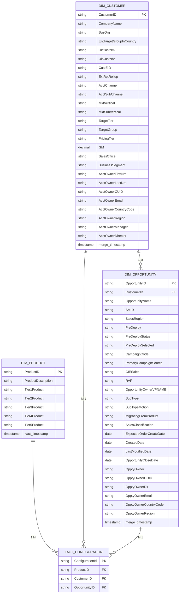

# Simplified Data Warehouse ER Diagram

## Snowflake Schema (Minimal - Essential Columns Only)

## Table Column Details

### DIM_PRODUCT (9 Columns)

| # | Column Name | Data Type | PK | Purpose |
|---|------------|-----------|----|---------| 
| 1 | ProductID | StringType() | ✓ | Product Identifier |
| 2 | ProductDescription | StringType() | | Product Description |
| 3 | Tier1Product | StringType() | | Tier 1 Product Category |
| 4 | Tier2Product | StringType() | | Tier 2 Product Category |
| 5 | Tier3Product | StringType() | | Tier 3 Product Category |
| 6 | Tier4Product | StringType() | | Tier 4 Product Category |
| 7 | Tier5Product | StringType() | | Tier 5 Product Category |
| 8 | xact_timestamp | TimestampType() | | Transaction Timestamp |

---

### DIM_CUSTOMER (26 Columns)

| # | Column Name | Data Type | PK | Purpose |
|---|------------|-----------|----|---------| 
| 1 | CustomerID | StringType() | ✓ | Customer Identifier (AcctID) |
| 2 | CompanyName | StringType() | | Company Name (AcctNm) |
| 3 | BusOrg | StringType() | | Business Organization |
| 4 | EntTargetGroupInCountry | StringType() | | Enterprise Target Group |
| 5 | UltCustNm | StringType() | | Ultimate Customer Name |
| 6 | UltCustNbr | StringType() | | Ultimate Customer Number |
| 7 | CustEID | StringType() | | Customer External ID |
| 8 | ExtRptRollup | StringType() | | External Reporting Rollup |
| 9 | AcctChannel | StringType() | | Account Channel |
| 10 | AcctSubChannel | StringType() | | Account Sub Channel |
| 11 | MktVertical | StringType() | | Market Vertical |
| 12 | MktSubVertical | StringType() | | Market Sub Vertical |
| 13 | TargetTier | StringType() | | Target Tier |
| 14 | TargetGroup | StringType() | | Target Group |
| 15 | PricingTier | StringType() | | Pricing Tier |
| 16 | GM | DecimalType(10,2) | | Gross Margin % |
| 17 | SalesOffice | StringType() | | Sales Office |
| 18 | BusinessSegment | StringType() | | Business Segment |
| 19 | AcctOwnerFirstNm | StringType() | | Account Owner First Name |
| 20 | AcctOwnerLastNm | StringType() | | Account Owner Last Name |
| 21 | AcctOwnerCUID | StringType() | | Account Owner SFDC User ID |
| 22 | AcctOwnerEmail | StringType() | | Account Owner Email |
| 23 | AcctOwnerCountryCode | StringType() | | Account Owner Country Code |
| 24 | AcctOwnerRegion | StringType() | | Account Owner Region |
| 25 | AcctOwnerManager | StringType() | | Account Owner Manager |
| 26 | AcctOwnerDirector | StringType() | | Account Owner Director |

---

### DIM_OPPORTUNITY (27 Columns)

| # | Column Name | Data Type | PK/FK | Purpose |
|---|------------|-----------|-------|---------| 
| 1 | OpportunityID | StringType() | PK | Opportunity Identifier |
| 2 | CustomerID | StringType() | FK | Customer Identifier |
| 3 | OpportunityName | StringType() | | Opportunity Name |
| 4 | SMID | StringType() | | Sales Manager ID |
| 5 | SalesRegion | StringType() | | Sales Region |
| 6 | PreDeploy | StringType() | | Pre-Deployment Status |
| 7 | PreDeployStatus | StringType() | | Pre-Deployment Detailed Status |
| 8 | PreDeploySelected | StringType() | | Pre-Deployment Selected (Y/N) |
| 9 | CampaignCode | StringType() | | Campaign Code |
| 10 | PrimaryCampaignSource | StringType() | | Primary Campaign Source |
| 11 | CIESales | StringType() | | CIE Sales (Y/N) |
| 12 | RVP | StringType() | | Regional Vice President |
| 13 | OpportunityOwnerVPNAME | StringType() | | Opportunity Owner VP Name |
| 14 | SubType | StringType() | | Opportunity Sub Type |
| 15 | SubTypeMotion | StringType() | | Sub Type Motion |
| 16 | MigratingFromProduct | StringType() | | Migrating From Product |
| 17 | SalesClassification | StringType() | | Sales Classification |
| 18 | ExpectedOrderCreateDate | DateType() | | Expected Order Create Date |
| 19 | CreatedDate | DateType() | | Created Date |
| 20 | LastModifiedDate | DateType() | | Last Modified Date |
| 21 | OpportunityCloseDate | DateType() | | Opportunity Close Date |
| 22 | OpptyOwner | StringType() | | Opportunity Owner Name |
| 23 | OpptyOwnerCUID | StringType() | | Opportunity Owner SFDC User ID |
| 24 | OpptyOwnerDir | StringType() | | Opportunity Owner Director |
| 25 | OpptyOwnerEmail | StringType() | | Opportunity Owner Email |
| 26 | OpptyOwnerCountryCode | StringType() | | Opportunity Owner Country Code |
| 27 | OpptyOwnerRegion | StringType() | | Opportunity Owner Region |

---

### FACT_CONFIGURATION (4 Columns - Keys Only)

| # | Column Name | Data Type | PK/FK | Purpose |
|---|------------|-----------|-------|---------| 
| 1 | ConfigurationId | StringType() | PK | Configuration Identifier |
| 2 | ProductID | StringType() | FK | Product Identifier |
| 3 | CustomerID | StringType() | FK | Customer Identifier |
| 4 | OpportunityID | StringType() | FK | Opportunity Identifier |

---

## Schema Statistics

- **DIM_PRODUCT**: 9 columns
- **DIM_CUSTOMER**: 26 columns
- **DIM_OPPORTUNITY**: 27 columns
- **FACT_CONFIGURATION**: 4 columns (keys only)
- **Total Columns**: 66 (across all tables)

---

**Last Updated**: 2026-06-04
