# Data Warehouse ER Diagram (Mermaid) - Redesigned Final Schema

## Snowflake Schema with Composite Keys & Expanded Dimensions

```mermaid
erDiagram
    DIM_PRODUCT ||--o{ FACT_CONFIGURATION : "1:M"
    DIM_LOCATION_ADDRESS ||--o{ FACT_CONFIGURATION : "1:M (LocationA)"
    DIM_LOCATION_ADDRESS ||--o{ FACT_CONFIGURATION : "1:M (LocationZ)"
    DIM_CUSTOMER ||--o{ FACT_CONFIGURATION : "M:1"
    DIM_CUSTOMER ||--o{ DIM_OPPORTUNITY : "1:M"
    DIM_OPPORTUNITY ||--o{ FACT_CONFIGURATION : "M:1"

    DIM_PRODUCT {
        string ProductID PK
        string ProductDescription
        string Tier1Product
        string Tier2Product
        string Tier3Product
        string Tier4Product
        string Tier5Product
        string SourceSystem
        timestamp xact_timestamp
    }

    DIM_LOCATION_ADDRESS {
        string LocationId PK
        string LocationType "A or Z"
        string Address
        string City
        string State
        string PostalCode
        string CountryCode
        string GLMLocId
        string GLMOriginalLocId
        string GLMParentId
        string GLMRegionCode
        string GLMRegionName
        string GLMCountryCode
        string GLMCountryName
        string GLMSalesArea
        string GLMShortName
        string GLMLongName
        string GLMStatus
        string GLMTimeZone
    }

    DIM_CUSTOMER {
        string CustomerID PK "AcctID"
        string CompanyName "AcctNm"
        string AcctType
        string Industry "NEW"
        string BusOrg
        string EntTargetGroupInCountry
        string UltCustNm
        string UltCustNbr
        string CustEID
        string ExtRptRollup
        string AcctChannel
        string AcctSubChannel
        string MktVertical
        string MktSubVertical
        string TargetTier
        string TargetGroup
        string PricingTier
        decimal GM
        string SalesOffice
        string BusinessSegment
        string AcctOwnerFirstNm
        string AcctOwnerLastNm
        string AcctOwnerCUID
        string AcctOwnerEmail
        string AcctOwnerCountryCode
        string AcctOwnerRegion
        string AcctOwnerSalesRegion "NEW"
        string SalesRegion "NEW"
        string AcctOwnerManager
        string AcctOwnerDirector
        timestamp merge_timestamp
    }

    DIM_OPPORTUNITY {
        string OpportunityID PK "OptyId"
        string QuoteID PK "SMID-renamed"
        string CustomerID FK
        string OpportunityName
        string RecordType
        string StageName
        string OpptyType
        string IsClosed "Y/N"
        string IsWon "Y/N"
        string IsQuoted "Y/N"
        string ReasonWonLostComments
        string PrimaryLostReason
        date SendToOrderDate
        string HasOpportunityLineItem
        string SalesRegion
        string PreDeploy
        string PreDeployStatus
        string PreDeploySelected
        string SubType
        string SubTypeMotion
        string MigratingFromProduct
        string SalesClassification
        date ExpectedOrderCreateDate
        string CampaignCode
        string PrimaryCampaignSource
        string CIESales
        string RVP
        string OpportunityOwnerVPNAME
        string ForecastCategory
        string SourceSystem
        string IsActive
        string OpptyOwner
        string OpptyOwnerCUID
        string OpptyOwnerDir
        string OpptyOwnerEmail
        string OpptyOwnerCountryCode
        string OpptyOwnerRegion
        date CreatedDate
        date LastModifiedDate
        date OpportunityCloseDate
        decimal TotalRevenue_USD
        decimal TotalNewSalesMRC_USD
        decimal TotalNetRecurring_USD
        timestamp merge_timestamp
    }

    FACT_CONFIGURATION {
        string ConfigurationId PK
        string ProductID FK
        string CustomerID FK
        string OpportunityID FK
        string QuoteID FK "Composite Key"
        string LocationIdA FK "Type=A"
        string LocationIdZ FK "Type=Z"
        string PriceDealId
        string UnitCostId
        int LineNumber
        string SourceName
        string EXTERNALQUOTEID
        string PriceDealEntityProductItemId
        int Term
        string PetraPricing "Y/N"
        string ColtIgnore "Y/N"
        string DQPID
        string Ignore "Y/N"
        string ReportRegion
        string VendorA
        string VendorZ
        string AccessType
        date QuoteCreateDate
        date QuoteUpdateDate
        decimal IntentA
        decimal IntentZ
        decimal AccessQuantity
        decimal PortQuantity
        decimal PortBW
        decimal AccessABW
        decimal AccessZBW
        decimal AccessASubBW
        decimal AccessZSubBW
        decimal TotalListMRC
        decimal TotalDiscountedMRC
        decimal TotalAmortizedMRC
        decimal AccessListMRC
        decimal AccessDiscountedMRC
        decimal AccessAmortizedMRC
        decimal TotalListNRC
        decimal TotalAmortizedNRC
        decimal AccessListNRC
        decimal AccessAmortizedNRC
        decimal GrossMargin
        decimal TotalDiscountedMRCwAmortized
        decimal AccessDiscountedMRCwAmortized
        decimal TotalListMrcOriginal
        decimal TotalCommit
        decimal TotalIncrementalMRCost
        decimal TotalIncrementalNRCost
        decimal TotalIncrementalCapexCost
        decimal AccessIncrementalMRCost
        decimal AccessIncrementalNRCost
        decimal AccessIncrementalCapexCost
        decimal TotalTermRevenueUSD
        decimal TotalTermEbitdaCostUSD
        decimal TotalTermEbitdaDollarsUSD
        decimal Payback
        timestamp xact_timestamp
    }
```



---

## Schema Overview

| Table | Columns | Key Features |
|-------|---------|--------------|
| **DIM_PRODUCT** | 9 | Product hierarchy (Tier1-5) |
| **DIM_LOCATION_ADDRESS** | 19 | ✓ Expanded GLM columns (ParentId, RegionCode, CountryCode, etc.) |
| **DIM_CUSTOMER** | 29 | ✓ NEW: Industry, AcctOwnerSalesRegion, SalesRegion |
| **DIM_OPPORTUNITY** | 40 | ✓ Composite Key (OpportunityID + QuoteID), Expanded fields |
| **FACT_CONFIGURATION** | 62 | ✓ Composite FK to DIM_OPPORTUNITY, VendorA/VendorZ |

**Total: 159 columns** across **5 tables**

---

## Key Changes & New Fields

### DIM_LOCATION_ADDRESS (GLM Expansion)
- ✅ GLMParentId
- ✅ GLMRegionCode
- ✅ GLMRegionName
- ✅ GLMCountryCode
- ✅ GLMCountryName
- ✅ GLMSalesArea
- ✅ GLMShortName
- ✅ GLMLongName
- ✅ GLMStatus
- ✅ GLMTimeZone

### DIM_CUSTOMER (Additions)
- ✅ Industry (NEW)
- ✅ AcctOwnerSalesRegion (NEW)
- ✅ SalesRegion (NEW)

### DIM_OPPORTUNITY (Redesigned)
- ✅ **Composite Key**: OpportunityID + QuoteID (SMID renamed)
- ✅ RecordType
- ✅ OpptyType
- ✅ IsClosed, IsWon, IsQuoted
- ✅ ReasonWonLostComments
- ✅ PrimaryLostReason
- ✅ SendToOrderDate
- ✅ HasOpportunityLineItem
- ✅ TotalRevenue_USD
- ✅ TotalNewSalesMRC_USD
- ✅ TotalNetRecurring_USD

### FACT_CONFIGURATION (Updates)
- ✅ Composite FK: OpportunityID + QuoteID
- ✅ VendorA (replaces Vendor for Location A)
- ✅ VendorZ (new for Location Z)
- ✅ 62 columns total (updated from 58)

---

## Relationship Changes

### New Composite Key Relationship
```
FACT_CONFIGURATION.OpportunityID + FACT_CONFIGURATION.QuoteID 
    → DIM_OPPORTUNITY.OpportunityID + DIM_OPPORTUNITY.QuoteID
```

### Location Vendors (Separated)
- **VendorA**: Vendor for LocationA (1:M from DIM_LOCATION_ADDRESS TypeA)
- **VendorZ**: Vendor for LocationZ (1:M from DIM_LOCATION_ADDRESS TypeZ)

---

**Schema Type**: Snowflake Schema with Composite Keys  
**Last Updated**: 2026-06-04  
**Version**: Final Redesigned
