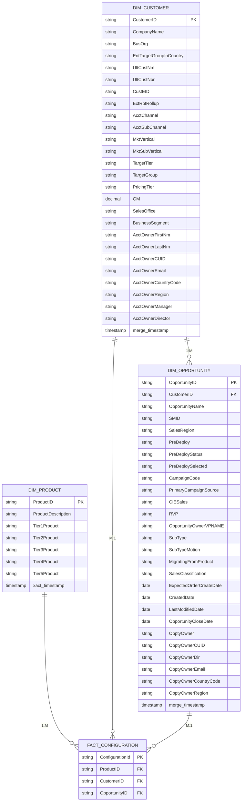

# Data Warehouse ER Diagram (Mermaid) - Simplified

## Snowflake Schema with Essential Columns Only

## Relationship Details

### 1:M Relationships

#### DIM_PRODUCT → FACT_CONFIGURATION (1:M)
- One product can be associated with many configurations
- Product hierarchy (Tier1-5) enables drill-down analysis

#### DIM_CUSTOMER → DIM_OPPORTUNITY (1:M)
- One customer can have many opportunities
- Enables customer lifetime value analysis

#### DIM_CUSTOMER → FACT_CONFIGURATION (M:1)
- Many configurations belong to a single customer
- Customer master data centralized

#### DIM_OPPORTUNITY → FACT_CONFIGURATION (M:1)
- Many configurations can be associated with a single opportunity
- Links configurations back to sales opportunities

---

## Schema Overview

| Table | Columns | Purpose |
|-------|---------|---------|
| **DIM_PRODUCT** | 9 | Product master with 5-tier hierarchy |
| **DIM_CUSTOMER** | 26 | Customer/Account data from SFDC |
| **DIM_OPPORTUNITY** | 27 | Sales opportunity data from SFDC |
| **FACT_CONFIGURATION** | 4 | Key relationships (Bridge table) |

---

**Schema Type**: Snowflake Schema (Star Schema with normalized dimensions)  
**Total Columns**: 66  
**Last Updated**: 2026-06-04
