# Data Warehouse ER Diagram (Mermaid) - Complete Simplified Schema

## Snowflake Schema with Essential Columns + All Fact Configuration Metrics

```mermaid
erDiagram
    DIM_PRODUCT ||--o{ FACT_CONFIGURATION : "1:M"
    DIM_LOCATION_ADDRESS ||--o{ FACT_CONFIGURATION : "1:M (LocationA)"
    DIM_LOCATION_ADDRESS ||--o{ FACT_CONFIGURATION : "1:M (LocationZ)"
    DIM_CUSTOMER ||--o{ FACT_CONFIGURATION : "M:1"
    DIM_CUSTOMER ||--o{ DIM_OPPORTUNITY : "1:M"
    DIM_OPPORTUNITY ||--o{ FACT_CONFIGURATION : "M:1"

    DIM_PRODUCT {
        string ProductID PK
        string ProductDescription
        string Tier1Product
        string Tier2Product
        string Tier3Product
        string Tier4Product
        string Tier5Product
        timestamp xact_timestamp
    }

    DIM_LOCATION_ADDRESS {
        string LocationId PK
        string LocationType "A or Z"
        string Address
        string City
        string State
        string PostalCode
        string CountryCode
        string GLMLocId
        string GLMOriginalLocId
    }

    DIM_CUSTOMER {
        string CustomerID PK
        string CompanyName
        string BusOrg
        string EntTargetGroupInCountry
        string UltCustNm
        string UltCustNbr
        string CustEID
        string ExtRptRollup
        string AcctChannel
        string AcctSubChannel
        string MktVertical
        string MktSubVertical
        string TargetTier
        string TargetGroup
        string PricingTier
        decimal GM
        string SalesOffice
        string BusinessSegment
        string AcctOwnerFirstNm
        string AcctOwnerLastNm
        string AcctOwnerCUID
        string AcctOwnerEmail
        string AcctOwnerCountryCode
        string AcctOwnerRegion
        string AcctOwnerManager
        string AcctOwnerDirector
        timestamp merge_timestamp
    }

    DIM_OPPORTUNITY {
        string OpportunityID PK
        string CustomerID FK
        string OpportunityName
        string SMID
        string SalesRegion
        string PreDeploy
        string PreDeployStatus
        string PreDeploySelected
        string CampaignCode
        string PrimaryCampaignSource
        string CIESales
        string RVP
        string OpportunityOwnerVPNAME
        string SubType
        string SubTypeMotion
        string MigratingFromProduct
        string SalesClassification
        date ExpectedOrderCreateDate
        date CreatedDate
        date LastModifiedDate
        date OpportunityCloseDate
        string OpptyOwner
        string OpptyOwnerCUID
        string OpptyOwnerDir
        string OpptyOwnerEmail
        string OpptyOwnerCountryCode
        string OpptyOwnerRegion
        timestamp merge_timestamp
    }

    FACT_CONFIGURATION {
        string ConfigurationId PK
        string ProductID FK
        string CustomerID FK
        string OpportunityID FK
        string LocationIdA FK "Type=A"
        string LocationIdZ FK "Type=Z"
        string PriceDealId
        string UnitCostId
        int LineNumber
        string SourceName
        string EXTERNALQUOTEID
        string PriceDealEntityProductItemId
        int Term
        string PetraPricing
        string ColtIgnore
        string DQPID
        string Ignore
        string ReportRegion
        string Vendor
        string AccessType
        date QuoteCreateDate
        date QuoteUpdateDate
        decimal IntentA
        decimal IntentZ
        decimal AccessQuantity
        decimal PortQuantity
        decimal PortBW
        decimal AccessABW
        decimal AccessZBW
        decimal AccessASubBW
        decimal AccessZSubBW
        decimal TotalListMRC
        decimal TotalDiscountedMRC
        decimal TotalAmortizedMRC
        decimal AccessListMRC
        decimal AccessDiscountedMRC
        decimal AccessAmortizedMRC
        decimal TotalListNRC
        decimal TotalAmortizedNRC
        decimal AccessListNRC
        decimal AccessAmortizedNRC
        decimal GrossMargin
        decimal TotalDiscountedMRCwAmortized
        decimal AccessDiscountedMRCwAmortized
        decimal TotalListMrcOriginal
        decimal TotalCommit
        decimal TotalIncrementalMRCost
        decimal TotalIncrementalNRCost
        decimal TotalIncrementalCapexCost
        decimal AccessIncrementalMRCost
        decimal AccessIncrementalNRCost
        decimal AccessIncrementalCapexCost
        decimal TotalTermRevenueUSD
        decimal TotalTermEbitdaCostUSD
        decimal TotalTermEbitdaDollarsUSD
        decimal Payback
        timestamp xact_timestamp
    }
```

## Relationship Details

### 1:M Relationships

#### DIM_PRODUCT → FACT_CONFIGURATION (1:M)
- One product can be associated with many configurations
- Product hierarchy (Tier1-5) enables drill-down analysis

#### DIM_LOCATION_ADDRESS → FACT_CONFIGURATION (1:M)
- Supports dual location references (LocationIdA, LocationIdZ)
- Each location type can have multiple configurations
- LocationType distinguishes between A and Z locations

#### DIM_CUSTOMER → DIM_OPPORTUNITY (1:M)
- One customer can have many opportunities
- Enables customer lifetime value analysis

#### DIM_CUSTOMER → FACT_CONFIGURATION (M:1)
- Many configurations belong to a single customer
- Customer master data centralized

#### DIM_OPPORTUNITY → FACT_CONFIGURATION (M:1)
- Many configurations can be associated with a single opportunity
- Links configurations back to sales opportunities

---

## Schema Overview

| Table | Columns | Purpose |
|-------|---------|---------|
| **DIM_PRODUCT** | 9 | Product master with 5-tier hierarchy |
| **DIM_LOCATION_ADDRESS** | 9 | Geographic and facility locations (A/Z types) |
| **DIM_CUSTOMER** | 26 | Customer/Account data from SFDC |
| **DIM_OPPORTUNITY** | 27 | Sales opportunity data from SFDC |
| **FACT_CONFIGURATION** | 58 | Configuration with all metrics + location FKs |

---

## FACT_CONFIGURATION Column Details

### Primary & Foreign Keys (6 columns)
- ConfigurationId (PK)
- ProductID (FK → DIM_PRODUCT)
- CustomerID (FK → DIM_CUSTOMER)
- OpportunityID (FK → DIM_OPPORTUNITY)
- LocationIdA (FK → DIM_LOCATION_ADDRESS, Type=A)
- LocationIdZ (FK → DIM_LOCATION_ADDRESS, Type=Z)

### Configuration Identifiers (6 columns)
- PriceDealId
- UnitCostId
- LineNumber
- SourceName
- EXTERNALQUOTEID
- PriceDealEntityProductItemId

### Configuration Attributes (8 columns)
- Term
- PetraPricing
- ColtIgnore
- DQPID
- Ignore
- ReportRegion
- Vendor
- AccessType

### Date Attributes (2 columns)
- QuoteCreateDate
- QuoteUpdateDate

### Intent Metrics (2 columns)
- IntentA
- IntentZ

### Quantity Metrics (7 columns)
- AccessQuantity
- PortQuantity
- PortBW
- AccessABW
- AccessZBW
- AccessASubBW
- AccessZSubBW

### Revenue Metrics - MRC (6 columns)
- TotalListMRC
- TotalDiscountedMRC
- TotalAmortizedMRC
- AccessListMRC
- AccessDiscountedMRC
- AccessAmortizedMRC

### Revenue Metrics - NRC (4 columns)
- TotalListNRC
- TotalAmortizedNRC
- AccessListNRC
- AccessAmortizedNRC

### Margin & Financial Metrics (5 columns)
- GrossMargin
- TotalDiscountedMRCwAmortized
- AccessDiscountedMRCwAmortized
- TotalListMrcOriginal
- TotalCommit

### Incremental Cost Metrics (6 columns)
- TotalIncrementalMRCost
- TotalIncrementalNRCost
- TotalIncrementalCapexCost
- AccessIncrementalMRCost
- AccessIncrementalNRCost
- AccessIncrementalCapexCost

### Term Revenue & Payback (4 columns)
- TotalTermRevenueUSD
- TotalTermEbitdaCostUSD
- TotalTermEbitdaDollarsUSD
- Payback

### Audit (1 column)
- xact_timestamp

---

**Total Columns Across Schema**: 129  
**Total Tables**: 5  
**Schema Type**: Snowflake Schema (Star Schema with normalized dimensions)  
**Last Updated**: 2026-06-04
